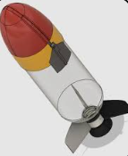

# Pi-In-The-Sky planning

We're going to be making a rocket/water rocket for our PI IN THE SKY project.
## Design 

Something like this is what we're going to build. 
## Plan
Next class period we'll lay out a schedule and a plan to to by, right now we don't have a schedule to manage ourselves.
