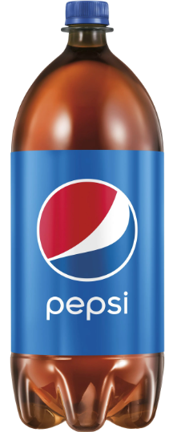

# Pi-In-The-Sky planning

We're going to be making a rocket/water rocket for our PI IN THE SKY project.

## Scope.  Is your project appropriately ambitious? 
I think our project is ambitious because I've never seen anyone try to put accelerometers and all those other things inside of a water bottle before, of course it's going to be a challenge try to keep all the things in there and to make sure it's not too heavy but we'll figure it out. 
## Diagrams of your planned design (CAD or hand sketched)

At first we were planning on going on onshape and building a 2 liter bottle out of CAD but we've decided to use a real two 2 liter bottle and just add the wires and stuff in there, Hopefully this plan will work.
## Bill of materials for the overall project
two 2 liter soda bottles and Circuit board. 
## Risk Mitigation
One big risk is the project being too heavy or just not working. Again, I've never seen an engineering project in which a 2 liter bottle is being used so I don't know how this is going to work out for sure. We were going to use a little water bottle but we need more space so I think that soleved one problem. We have the space now, It's just things might move around more because trhere's lots of space and it probably won't stay still. 

## Develop an initial design (pencil and paper, CAD, etc.)
[CAD](https://cvilleschools.onshape.com/documents/3e4d9e6db1d7c213b08b98f4/w/cb6daed488f8fdf9e05e1dfa/e/c9bda002f40a3f28976983cc)
## Construct a prototype
## Test your design
## Refine/optimize your design
## Present finished product
