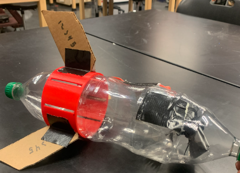

# Pi-In-The-Sky planning

# Project Proposal

We're going to be making a rocket/water rocket for our PI IN THE SKY project. Success will be when we are able to launch this rocket out of the air cannon, have the pico capture the mph we went througout the launch, capture the highest mph and present it on the OLED screen, deploy a parachute to slow its fall, and land safe and intact.


## Scope.  Is your project appropriately ambitious? 
I think our project is ambitious because I've never seen anyone try to put accelerometers and all those other things inside of a flimsy soda bottle before, of course it's going to be a challenge try to keep all the things in there and to make sure it's not too heavy but we'll figure it out. this along with the parachute and OLED screen demonstrate an ambitious plan for our project. 

## Diagrams of your planned design (CAD or hand sketched)
 


[CAD](https://cvilleschools.onshape.com/documents/3e4d9e6db1d7c213b08b98f4/w/cb6daed488f8fdf9e05e1dfa/e/8094d509666b8486e34db21e)


At first we were planning on going on onshape and building a 2 liter bottle out of CAD but we've decided to use a real two 2 liter bottle and just add the wires and stuff in there, Hopefully this plan will work considering its lack of structure and protection. we also have a parachute that will be deploying. 
# Bill of materials for the overall project
two 2 liter soda bottles, Circuit board, Duct tape, card boards for the wings and parachuete made with plastic bag and strings. (prototype)

Two 2 liter soda bottles, circuit board, duct tape, 3D modeled and designed wings with screw holes, plastic and strings for our parachute. (main  design) BMP180 for altitute and an OLED screen so show the altitude.
# Risk Mitigation
One big risk is the project being too heavy or just not working. Again, I've never seen an engineering project in which a 2 liter bottle is being used so I don't know how this is going to work out for sure. We were going to use a little water bottle but we need more space so I think that solved one problem. We have the space now, It's just things might move around more because there's lots of space and it probably won't stay still. Risk mitigation may include making sure there is enough open space around the launch, making sure everyone involved has the proper PPE (ex: safety glasses), or even that the materials (rocket motors, hairspray, etc) are stored safely.

# Develop an initial design (pencil and paper, CAD, etc.)
[CAD](https://cvilleschools.onshape.com/documents/3e4d9e6db1d7c213b08b98f4/w/cb6daed488f8fdf9e05e1dfa/e/c9bda002f40a3f28976983cc)
We don't have code right now as we're just worrying on the design, but it will be able to present to us the highest mph that it hit after launch. 
# Construct a prototype
 

Prototype complete and ready to launch.
# Test your design
 

We've been launching the bottle rocket for a few days and it's been going well, everything is good except for the parachute. For some reason it won't pop out properly and we have to leave it out in a specific way for it to work or it won't pop out. Also it's a bit wobbly and won't come down slowly.we're thinking of making/adding a thinner and better rocket cap to help with the wobble.
# Refine/optimize your design

We are adding better and more affective wings, helping with wobble and with hieght, and they're going to be 3D printed ring to fit around the bottle with slits to slide in disposible cardboard wings. We hope that the ring doesn't break when it hits the ground, considering its been an issue with others projects. 
# Present finished product
# Flight Ready by Spring Break
Milestone Criteria:
Code: Your code is complete to a point where it can successfully run during the flight, collect data, and save that data to a file onboard the RPi Pico. 

Circuit Board: Your circuit board is fully soldered with the necessary boards for data collection and power supply to the RPi Pico. 

Physical Design: Your CAD design has been translated to the real world. Through 3D printing, laser cutting, or other methods, you have a physical object ready for launch.

Assembly: Everything is ready to go for launch. The circuit board is securely attached. There is nothing stopping you from walking out the door and launching your design. 

Survivability: Your design has a strong possibility of surviving and continuing to function post-flight. It is up to you to convince me that your systems are enough to ensure survival.

Documentation: Your github repo appropriately documents your progress thus far.  
# Schedule 
## 1/16-1/20 (have parachute done)
code is still being worked on, parachute has been redesigned and made better. 
## 1/24-1/27 (Finish the prototype)
1/25/23- We finished the prototype, We'll test launch it soon, but for now we'll be working on the code and building the circuit board. We'll also need to find out where we're going to put the circuit board, inside the rocket? outside of the rocket? We don't know yet but we'll figure it out soon.
## 1/27/23 (Launching the prototype)
We were going to launch today (1/26/23) but the launcher isn't here so we have to wait.
## 1/30-2/3 
Launch the prototype a couple of times and have the code working for the altitude. 
## 2/6/23-2/9/23
Launches went well, parachute deployed after changing the way it deployed. flew rather high, 40 feet before parachute deployed but I believe we can improve that. 
## 2/10/23-2/16/23
Have the parachute launching properly and have the 3D printed wings working. Changed wings into a ring with slots for disposible wings. Had to measure cardboard so the slits would work. Ring should fit over 2 liter bottle.  
## 2/22/23/-3/1/23
Make slots for the 3D printed part and attach the wings on to it and have a new parachute. Test if disposible wings are the correct choice for our rocket wings. 
## 3/2/23-3/10/23
We had our wing loop 3D printed, and realized it was way too big and way too short. So, we went back through and changed the dimensions of the part on cad and resent it to be printed again. Wing loop came back again, and now it is too small. redesigning and testing dimentions took all of friday but we were able to submit before the end of class.
## 3/13/23-3/17/23
With everything done on the project all we need is an effective parachute, the wing loop has been 3D printed to the correct measurements and is working, a working parachute is the last thing before we are completly done with the building part of the project. The code works but we might tweak it to add a thing or two. 
## 3/20/23-3/25/23
launching with the new parachutes this week. soldered everything and are now just testing. Launching went badly, great height but not only did the ring for the wings break, but the parachute also refused to deploy as well. 
## 3/27/23-3/30/23
Solder a new board as we messed up on the last one, have the new parachute functioning, the wing loop fitted perfectly as we need to launch after spring break.
## 4/10/23-4/14/23
This week we need to finish soldering and remove the parachute as its the only thing holding us back right now, the code we have allows us to print the data but now we need to learn how to make it save so we can extract it later. Once we're done with that, we'll be done with the project. Parachute is finally deploying correctly and consistently, and the rocket is shooting very high on every attempt. 
## 4/17/23-4/21/23
Get the soldering done this week and testing last model of the parachute 
## 4/24/23-4/28/23
finish up the code and solder the board correctly so that the code can work correctly. 
## 5/1/23-5/5/23
We finished the soldering and everything works, all we have to do is assemble the parts and we'll be done. We're testing launching on Thursday. it launched perfectly, reaching a peak of 15 meters with the parachute deploying perfectly.
## 5/8/23-5/12/23
On Tursday we've completed all of the code and soldered the switch on the circuitboard. Everything is complete and the data is on the spreadsheet, Tomorrow we'll launch the rocket and get better results. 
## 5/15/23-5/19/23

## 5/22/23-5/26/23

## 5/29/23-6/2/23

## 6/5/23-6/9/23

```python

# SPDX-FileCopyrightText: 2019 Tony DiCola for Adafruit Industries
# SPDX-License-Identifier: MIT

# Simple demo of the MPL3115A2 sensor.
# Will read the pressure and temperature and print them out every second.
# type: ignore
import time
import board
import adafruit_displayio_ssd1306
import mpl3115a2_highspeed
import busio
import terminalio
import displayio
from adafruit_display_text import label
import storage

displayio.release_displays()
sda_pin0 = board.GP0
scl_pin0 = board.GP1
i2c0 = busio.I2C(scl_pin0, sda_pin0)
sensor = mpl3115a2_highspeed.MPL3115A2(i2c0)
sensor.sealevel_pressure = 102250

sda_pin1 = board.GP14
scl_pin1 = board.GP15
i2c1 = busio.I2C(scl_pin1, sda_pin1)


displayio.release_displays()
display_bus = displayio.I2CDisplay(i2c1, device_address=0x3d, reset=board.GP16)
display = adafruit_displayio_ssd1306.SSD1306(display_bus, width=128, height=64)


altitude_list = []
with open("/data.csv", "a") as fp:
    while True:
        altitude_list.append(sensor.altitude)
        print ("Max value element : ", max(altitude_list))
        print ("current altitude : ", sensor.altitude)
        max(altitude_list)
        print ("")
        splash = displayio.Group()
        title = "HIGHEST ALTITUDE"
        text_area = label.Label(terminalio.FONT, text=title, color=0xFFFF00, x=5, y=5)
        splash.append(text_area)  
        display.show  
        title = str(max(altitude_list))
        text_area = label.Label(terminalio.FONT, text=title, color=0xFFFF00, x=5, y=20)
        splash.append(text_area) 
        display.show(splash)
        fp.write(f"{time.monotonic()}, {sensor.altitude}\n")
        fp.flush()

```


```python

# SPDX-FileCopyrightText: 2021 Kattni Rembor for Adafruit Industries
#
# SPDX-License-Identifier: MIT

"""
boot.py file for Pico data logging example. If pin GP0 is connected to GND when
the pico starts up, make the filesystem writeable by CircuitPython.
"""
import board
import digitalio
import storage

write_pin = digitalio.DigitalInOut(board.GP21)
write_pin.direction = digitalio.Direction.INPUT
write_pin.pull = digitalio.Pull.UP

# If write pin is connected to ground on start-up, CircuitPython can write to CIRCUITPY filesystem.
if not write_pin.value:
    storage.remount("/", readonly=False)

```
